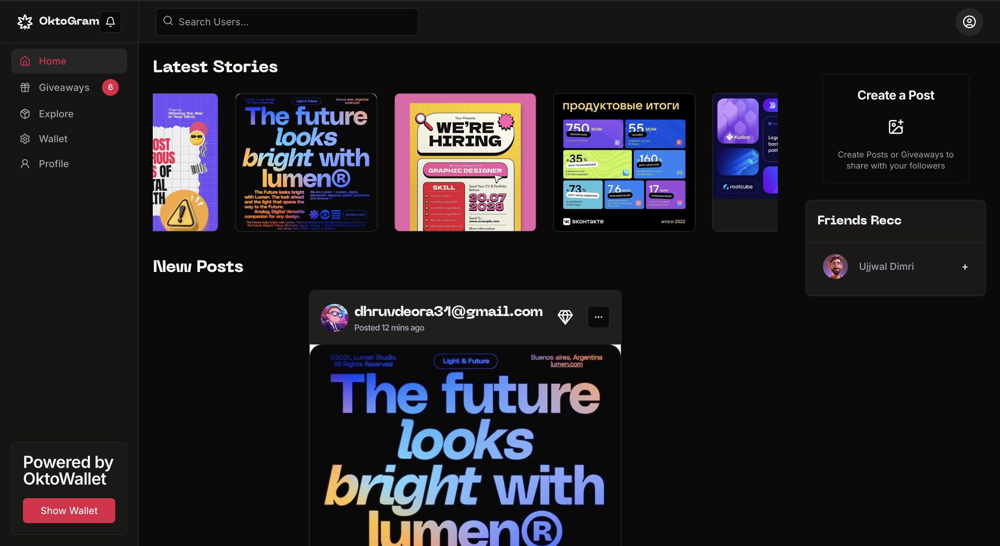

# OktoGram

## Project Structure

The project is divided into two main parts:

- **Backend**: This folder contains the server-side code that powers the application. To set up the backend, navigate to the `backend` folder and follow the instructions provided in the `README.md` file.

- **Frontend**: This folder contains the client-side code, responsible for the user interface and experience. To set up the frontend, navigate to the `frontend` folder and follow the instructions provided in the `README.md` file.

## Demo

You can check out a live demo of our application [here](https://oktogram.ujwl.in).

## Video Walkthrough

For a detailed walkthrough of the application and its features, watch our demo video [here](https://www.loom.com/share/206c6a24b17441f69c0fd72c78a0c95f?sid=97ea7591-853d-40bf-9663-87a8c3d3d2e0).

## About the Application

Our application is a cutting-edge social media platform built on web3 technology, offering users a modern and engaging experience:

- **Modern UI**: Designed with the latest best practices, our application features an intuitive and visually appealing user interface.

- **Okto Authentication**: Secure and seamless user authentication is powered by Okto Custodial Wallet, ensuring that your web3 interactions are both safe and user-friendly.

- **Awarding Posts**: Users can reward valuable content by sending tokens directly to the poster's account using the Okto Wallet, fostering a community-driven environment.

- **Giveaways**: Our innovative giveaway feature activates once a post reaches a certain number of likes, automatically awarding a free NFT to a random liker, adding excitement and engagement to the platform.

## Future Plans and Business Objectives

Looking ahead, we have ambitious plans to expand the capabilities of our platform:

1. **Mass Giveaways and Airdrops**: Our application can serve as a powerful tool for token promotion, enabling businesses and projects to conduct mass giveaways and airdrops to boost visibility and engagement.

2. **Educational Integration**: We plan to enhance our like-based feature by integrating it with educational content. For example, users who complete specific mini-courses could receive an NFT as a reward, promoting learning and engagement on the platform.

3. **NFT Authenticity**: Given the focus on photos and user-generated content, we aim to evolve the platform by converting posted photos into NFTs. This will provide an originality stamp, ensuring the uniqueness and authenticity of every piece of content shared on our platform.

We are excited about the future of our application and the possibilities it holds for users, businesses, and the broader web3 ecosystem.
